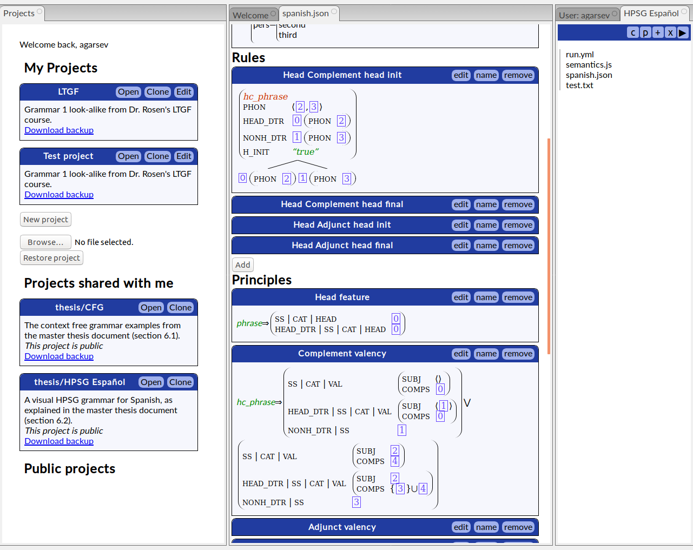
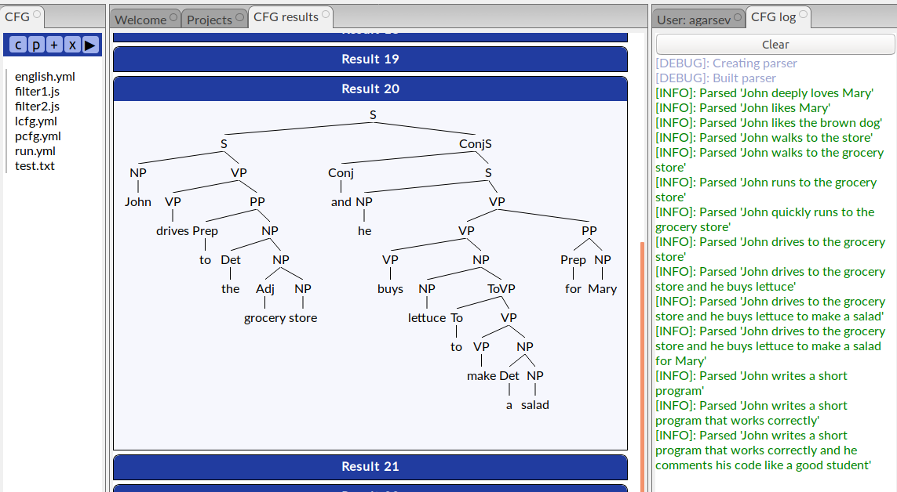
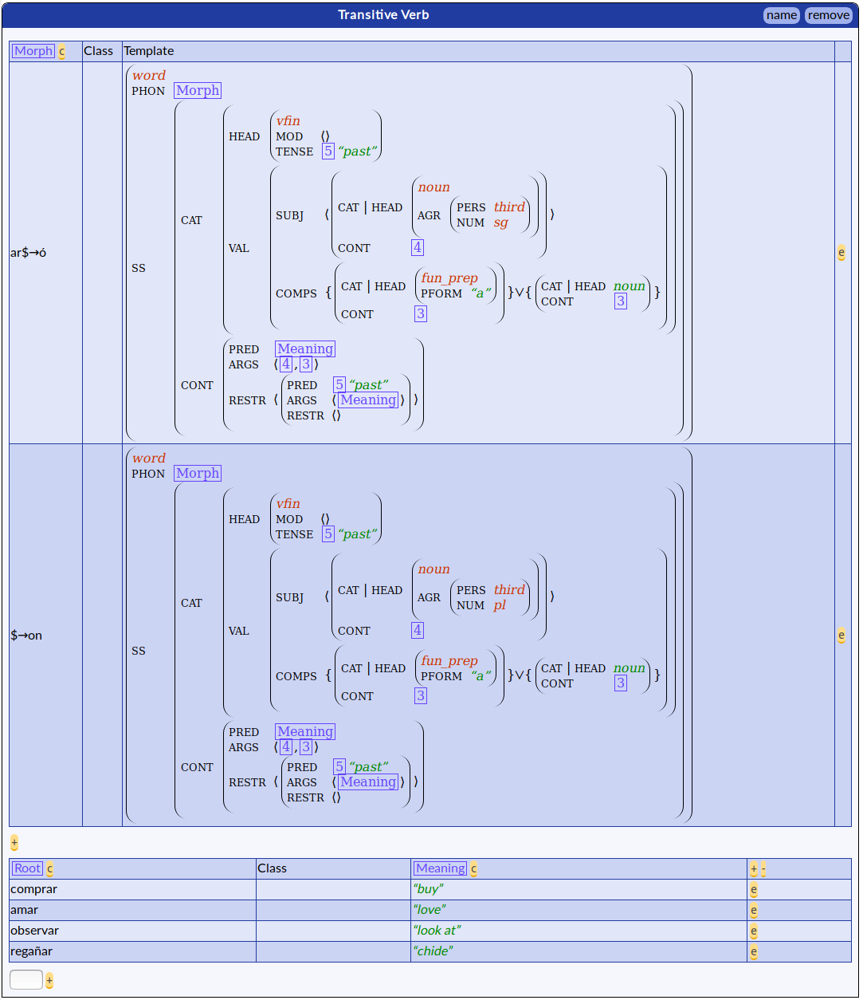

# BOLDE

### Borjes Online Linguistics Development Environment.

This is an prototype online IDE for computational linguistics, centered on
grammar development, as described in my [master thesis](https://garciasevilla.com/biblio/AFGSevilla_Masterthesis.pdf).
An online demo version is available [here](https://garciasevilla.com/bolde/).

BOLDE is meant as an academic work for demonstration, and probably would need a
lot of work for real use. I upload it here because there seems to be some
interest. While BOLDE is not fully supported, I am available for some
consultation, especially in case there is interest for further or related
development :)

### Screenshots

Project workflow and HPSG grammars:

CFG Parsing results and tree visualizer:

A morphological lexicon, which is a nice visual editor for lexical rules:

## Install

The installation procedure is untested (because of "runs on my server" syndrome)
but, in theory, the following steps should work:

1. Run `make update`.
2. Customize `config/welcome.md`.
3. Run `make`. Check that the `build/` folder was created correctly, and
   `bundle.js` (the app code) is present.
4. Create user files folder (for example, `mkdir user_files`).
5. Create logs folder (for example `mkdir logs`).
6. Copy `config/default.yml` to `config/local.yml` and customize.
7. Put extra static assets that you need in `static/` (if any, this step is optional).
8. Launch with `npm start`.

**Tip**: To check that the server is running, you can try to `curl
localhost:3000` (if you didn't change the port or path).

## Related

1. [borjes](https://github.com/agarsev/borjes)
2. [borjes-react](https://github.com/agarsev/borjes-react)

## Author

Antonio F. G. Sevilla

https://garciasevilla.com
